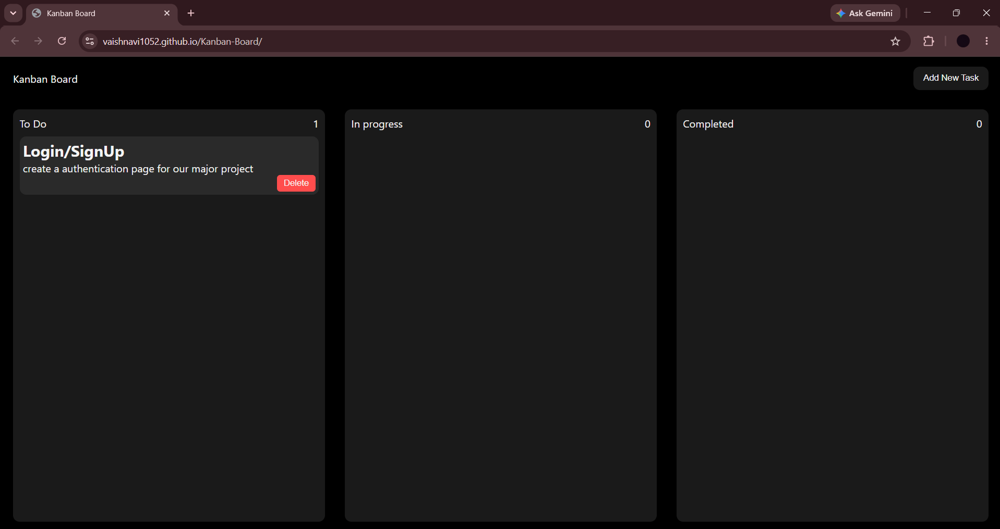

# 📌 Kanban Board

A modern and responsive **Kanban Board** built using **HTML, CSS, and JavaScript**. The application enables users to efficiently manage tasks by creating, organizing, moving, and deleting them through an intuitive drag-and-drop interface.

Tasks are automatically saved using the browser's **Local Storage API**, ensuring data persists even after refreshing or reopening the browser.

---

## 🚀 Live Demo

🌐 **Website:**  
https://vaishnavi1052.github.io/Kanban-Board/

---

## 📸 Screenshot



---

## ✨ Features

- ➕ Add new tasks
- 🗑️ Delete tasks
- 🎯 Drag and drop tasks between columns
- 💾 Persistent storage using Local Storage
- 📊 Automatic task count updates
- 📱 Responsive user interface
- ⚡ Fast and lightweight (No external libraries)

---

## 🛠️ Built With

- HTML5
- CSS3
- JavaScript (ES6)
- HTML Drag and Drop API
- Local Storage API

---

## 📂 Folder Structure

```text
Kanban-Board/
│
├── index.html
├── style.css
├── script.js
├── screenshot.png
└── README.md
```

---

## ⚙️ Installation

Clone the repository

```bash
git clone https://github.com/vaishnavi1052/Kanban-Board.git
```

Navigate to the project

```bash
cd Kanban-Board
```

Open `index.html` in your preferred browser.

No additional dependencies or installation are required.

---

## 🧠 What I Learned

Building this project helped me strengthen my understanding of:

- DOM Manipulation
- Event Handling
- JavaScript Functions
- Dynamic Element Creation
- Drag & Drop API
- Local Storage
- Array Methods (`map()`, `Array.from()`)
- Code Refactoring and Reusability
- State Persistence

---

## 📈 Future Improvements

- ✏️ Edit existing tasks
- 🏷️ Task priorities
- 📅 Due dates
- 🔍 Search tasks
- 🎨 Light/Dark mode
- 📌 Task labels
- 📂 Drag-and-drop ordering within columns

---

## 👩‍💻 Author

**Vaishnavi Sharma**

GitHub: https://github.com/vaishnavi1052

LinkedIn: *(Add your LinkedIn profile here)*

---

## ⭐ Support

If you found this project useful or interesting, consider giving it a ⭐ on GitHub.
